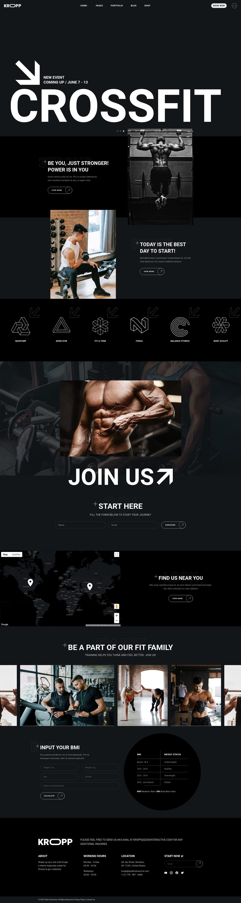

# KROPP — лендинг фитнес-клуба

Мой третий учебный проект — одностраничный сайт фитнес-клуба. Задача работы — усложнить вёрстку по сравнению с предыдущими проектами: длинная страница из одиннадцати блоков, CSS Grid, декоративные псевдоэлементы и более глубокий SCSS.

### Демо

**https://ggadjiev.github.io/KROPP/**




## Что на странице

* шапка с навигацией и бургер-кнопкой;
* баннер анонса события CROSSFIT с датами в `<time>` и пагинацией;
* две презентационные секции — «Be you, just stronger!» и «Today is the best day to start!»;
* сетка из шести залов с SVG-иконками;
* секция с видео и круглой Play-кнопкой;
* форма подписки «Join Us»;
* блок «Find us near you» с картой;
* фотолента «Be a part of our fit family»;
* форма расчёта BMI и таблица норм веса;
* подвал с контактами, часами работы, подпиской и соцсетями.

## Технологии

* **HTML5** — семантическая разметка (`header`, `main`, `section`, `nav`, `footer`), скрытые заголовки для скринридеров, связка `<label>` с полями, `<table>` с `<caption>`, даты в `<time datetime>`.
* **CSS3** — Flexbox и CSS Grid, псевдоэлементы `::before`/`::after`, функция `min()`, `vw`-единицы, логические свойства (`margin-inline`, `margin-block`), отрицательные отступы для наложения секций.
* **SCSS** — переменные, вложенность, элементы и модификаторы в духе БЭМ (`&__element`, `&_modifier`).
* **Шрифты** — Heebo и Yantramanav подключены локально через `@font-face` в форматах woff2 и woff.
* **Normalize.css** — единая отправная точка стилей в браузерах.
* **Flaticon Uicons** — иконки соцсетей с CDN.
* **Инструменты** — dart-sass для компиляции стилей, GitHub Actions для деплоя.


## Чему научился

* осознанно выбирать между Flexbox и Grid под конкретную задачу, а не верстать всем одним;
* проектировать систему модификаторов, которую переиспользуют шесть секций без копирования стилей;
* переносить в код детали готового дизайна вплоть до наложения секций и контурного текста;
* подключать локальные шрифты с `font-display: swap` и настраивать сборку dart-sass;
* настраивать автоматический деплой GitHub Actions на GitHub Pages.

## Запуск локально

```bash
git clone https://github.com/ggadjiev/KROPP.git
cd KROPP
npm install   # установит dart-sass
npm run sass  # компиляция src/scss -> src/css в режиме watch
```

Откройте `src/index.html` — удобно через Live Server в VS Code. Скомпилированный `css/style.css` уже лежит в репозитории, поэтому страница откроется и без запуска сборки.

## Структура проекта

```
├── .github/
│   └── workflows/
│       └── static.yml    # автодеплой папки src/ на GitHub Pages
├── package.json          # dart-sass и скрипт watch
└── src/                  # эта папка целиком уходит на GitHub Pages
    ├── index.html        # единственная страница
    ├── css/
    │   ├── normalize.css # сброс стилей браузера
    │   └── style.css     # скомпилированный CSS (+ source map)
    ├── scss/
    │   └── style.scss    # исходник всех стилей
    ├── fonts/            # Heebo, Yantramanav (woff2, woff)
    ├── icons/            # SVG-иконки интерфейса
    └── img/              # фото и фоновые изображения
```